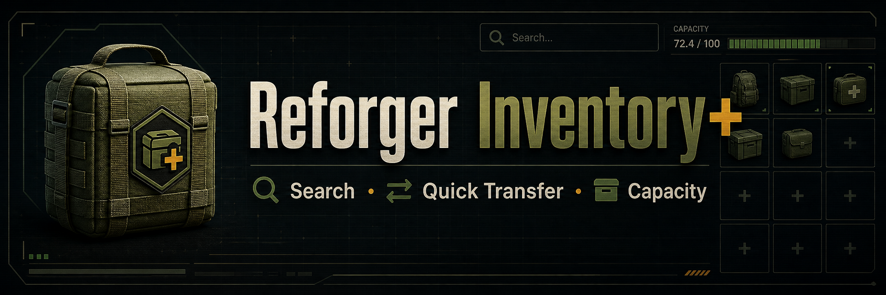

# Reforger Inventory+




**Smart inventory management for ARMA Reforger** - A comprehensive quality-of-life mod that modernizes the inventory system with search, quick transfer, visual indicators, and intelligent organization.

## 🎯 Features

### ✅ Current (v0.1.0-alpha)

- 🔍 **Search Bar** - Quickly find items across all containers with aggregate counts
- 📊 **Visual Indicators** - Color-coded weight/capacity bars with real-time updates
- ⚡ **Category Quick Transfer** - Move all ammo, medical supplies, or equipment with one click
- 👁️ **Enhanced Vicinity View** - Larger, scrollable preview of nearby items

### 🚧 Planned Features

#### Phase 2: Quality of Life

- 🔄 **Magazine Consolidation** - Combine partially-filled magazines
- ⌨️ **Graduated Stack Moving** - Shift+drag (5 items) / Ctrl+drag (maximum)
- 📦 **Simultaneous Container View** - See all storage at once
- 🗑️ **Quick Drop** - Rapid junk item disposal

#### Phase 3: Advanced

- 🎯 **Auto-Sorting** - Organize by category with one button
- 💾 **Loadout Save/Load** - Store and recall equipment configurations
- ⚙️ **Custom Keybindings** - Personalize your controls
- 🎖️ **Arsenal Integration** - Enhanced arsenal experience

#### Phase 4: Polish

- 🌐 **Settings Menu** - Deep configurability
- 🔗 **Mod Compatibility** - Works with popular mods
- ⚡ **Performance Optimization** - Tuned for large servers
- 🌍 **Localization** - Multiple language support


## 📌 Compatibility Status (checked May 2, 2026)

- ✅ **Current stable target:** `1.6.0.119`
- ⚠️ **Experimental watchlist:** `1.7.0.30` is currently Experimental and needs runtime validation before support is claimed.
- ✅ **Inventory+ status:** Updated for public-readiness notes and fixed capacity/name edge cases found during this review.
- ⚠️ **Server reality check:** Popular modded ecosystems frequently run WCS-style packs, HQC/Conflict variants, loadout editors, and wearable storage mods.

See [docs/COMPATIBILITY.md](docs/COMPATIBILITY.md) for source links and the current compatibility watchlist.

### Recommended Next Steps

- Run a dedicated-server smoke test on a heavily modded 1.6.0.119 stack (especially WCS-style load orders).
- Prioritize testing for UI overlap and inventory operation callbacks under high-population/queue-heavy servers.
- Open community compatibility reports after first public Workshop release.

## 📥 Installation

### For Players

1. **Subscribe on Workshop** (coming soon)
   - Visit the [Arma Reforger Workshop](https://reforger.armaplatform.com/workshop)
   - Search for “Reforger Inventory+”
   - Click Subscribe
1. **Manual Installation**
   - Download the latest release from [Releases](https://github.com/Rangion42/ReforgerInventoryPlus/releases)
   - Extract to your Reforger mods folder
   - Enable in the game’s mod menu

### For Server Administrators

Add to your server’s mod configuration:

```json
{
  "modId": "WORKSHOP_ID_HERE",
  "name": "ReforgerInventoryPlus",
  "version": "0.1.0"
}
```

## 🎮 Usage

### Search Functionality

- Press `Tab` to open inventory
- Use the search bar at the top to filter items
- View aggregate counts for ammunition and medical supplies

### Quick Transfer

- Click category buttons to move all items of that type
- Works between inventory and vicinity, or between storage containers
- Categories: Weapons, Ammo, Medical, Equipment, All

### Visual Indicators

- **Green bar**: Under 70% capacity
- **Yellow bar**: 70-90% capacity
- **Red bar**: Over 90% capacity

## 🛠️ Technical Details

### Architecture

Built on Reforger’s Enfusion engine using:

- **InventoryStorageManagerComponent** - Core inventory operations
- **SCR_InventoryStorageManagerComponent** - Extended functionality
- **BaseInventoryStorageComponent** - Storage enumeration and capacity tracking
- **InventoryItemComponent** - Display names, descriptions, and weight data

### Key Design Decisions

1. **Server-Authoritative** - All inventory modifications validated server-side to prevent exploits
1. **Client-Side Search** - Queries run locally for instant results without server load
1. **Batched Operations** - Category transfers process a limited number of items per frame
1. **Local Player Scope** - UI managers initialize only for the local controlled character

### Performance Considerations

- Search queries enumerate local storages client-side with debounce protection
- Weight calculations use `GetTotalWeightOfAllStorages()` with caching
- Category transfers batch operations to avoid frame hitches
- Vicinity scanning uses configurable range and refresh intervals

## 🤝 Contributing

We welcome contributions! Here’s how to get started:

### Development Setup

1. **Clone the repository**
   
   ```bash
   git clone https://github.com/Rangion42/ReforgerInventoryPlus.git
   cd ReforgerInventoryPlus
   ```
1. **Install Arma Reforger Workbench**
   - Download from [Bohemia Interactive](https://reforger.armaplatform.com/)
   - Follow the [official modding documentation](https://community.bistudio.com/wiki/Arma_Reforger:Modding)
1. **Open in Workbench**
   - Launch Arma Reforger Workbench
   - Open the project file
   - Configure your addon settings

### Coding Standards

- **Naming Convention**: Use your own prefix (not `SCR_` which is Bohemia’s)
- **Use Try-prefixed methods** (`TryInsertItem`, `TryMoveItemToStorage`, etc.)
- **Comment complex logic** especially around inventory movement and UI refresh timing

### Testing Requirements

#### Automated (CI-friendly)

- ✅ Run static checks: `python3 tools/ci/check_static.py`
- ✅ GitHub Actions workflow (`.github/workflows/ci.yml`) runs static validation on every push/PR

#### Manual (Workbench / game runtime required)

- ✅ Test in single-player first
- ✅ Test on dedicated server (inventory authority and sync issues often only appear there)
- ✅ Test with full inventories (edge cases)
- ✅ Test with high latency (multiplayer sync)
- ✅ Check for memory leaks during extended sessions


### 🤝 Community Test Request (especially mod compatibility)

We need help testing with **other mods** before release. If you run public servers or large client mod lists, please share results.

**High-priority combinations to test:**
- ACE Anvil + Reforger Inventory+
- RHS: Status Quo + Reforger Inventory+
- BetterInventory + Reforger Inventory+ (feature overlap checks)
- Any large custom server pack (WCS/HQC/Spearhead-style)

**Please report:**
- Game version and server type
- Full mod list + load order
- Repro steps, expected result, actual result
- Client/server logs or screenshots if available

Open an issue here: [GitHub Issues](https://github.com/Rangion42/ReforgerInventoryPlus/issues).

### Pull Request Process

1. Fork the repository
1. Create a feature branch (`git checkout -b feature/AmazingFeature`)
1. Commit your changes (`git commit -m 'Add some AmazingFeature'`)
1. Push to the branch (`git push origin feature/AmazingFeature`)
1. Open a Pull Request with a clear description

## 📋 Known Issues

- **Controller Input Conflict**: Multiple controllers (HOTAS, racing wheels) can break drag-and-drop. Workaround: Unplug secondary controllers.
- **Layout Compatibility**: Game updates may require UI layout adjustments.

See the [Issues](https://github.com/Rangion42/ReforgerInventoryPlus/issues) page for a complete list and to report bugs.

## 🔍 Compatibility

### Targeted

- ✅ Vanilla Arma Reforger (1.6 branch)
- 🎯 ACE Anvil
- 🎯 RHS: Status Quo
- 🎯 Bacon Loadout Editor
- 🎯 WCS-style gear and Conflict/HQC packs
- 🎯 Wearable storage mods such as Battle Belts & Bags

Compatibility with specific mod packs should be treated as community-tested only after reports include game version, environment, load order, repro notes, and logs or screenshots.

### High-Population/Modded Server Targets

- 🎯 WCS-style Conflict/HQC servers
- 🎯 Spearhead-style hardcore servers
- 🎯 Overthrow/Freedom Fighters style persistent scenarios

### Known Conflicts

- None currently identified

## 🖼️ Media Kit

Public launch and Workshop artwork lives in [media](media/).

| Asset | Intended Use |
| --- | --- |
| [Logo](media/reforger-inventory-plus-logo.png) | GitHub avatar, icon, square preview |
| [Workshop thumbnail](media/reforger-inventory-plus-workshop-thumbnail.png) | Arma Reforger Workshop cover/thumbnail |
| [Banner](media/reforger-inventory-plus-banner.png) | README, GitHub/social headers |
| [Social tile](media/reforger-inventory-plus-social-tile.png) | Reddit, Discord, and social announcements |
| [Concept sheet](media/media-kit-concept-sheet.png) | Visual identity reference |

## 📚 Resources

### Learning Reforger Modding

- [Arma Reforger Wiki](https://community.bistudio.com/wiki/Arma_Reforger)
- [Enfusion Script API](https://community.bistudio.com/wikidata/external-data/arma-reforger/EnfusionScriptAPIPublic/)
- [InventoryStorageManagerComponent Reference](https://community.bistudio.com/wikidata/external-data/arma-reforger/ArmaReforgerScriptAPIPublic/interfaceInventoryStorageManagerComponent.html)
- [Replication Overview](https://community.bistudio.com/wikidata/external-data/arma-reforger/EnfusionScriptAPIPublic/Page_Replication_Overview.html)

### Inspiration & Prior Art

- [ACE3 for ARMA 3](https://ace3.acemod.org/) - Magazine repacking inspiration
- [SearchInventory (DayZ)](https://steamcommunity.com/workshop/filedetails/?id=2936585965) - Search functionality patterns
- [Better Inventory (ARMA 3)](https://steamcommunity.com/workshop/filedetails/?id=2791403093) - Stack moving conventions

## 📄 License

This project is licensed under the MIT License - see the <LICENSE> file for details.

Reforger Inventory+ is created and maintained by **Rangion42**. If you fork, reuse, bundle, or build from this project, please preserve attribution and link back to:

https://github.com/Rangion42/ReforgerInventoryPlus

## 👏 Acknowledgments

- **Bohemia Interactive** - For Arma Reforger and the Enfusion engine
- **ACE3 Team** - Inspiration from their magazine repack system
- **Reforger Modding Community** - For sharing knowledge and best practices
- **Beta Testers** - Thank you for helping identify issues early

## 💬 Support & Community

- **Discord**: [Join our server](https://discord.gg/yourserver) (coming soon)
- **Issues**: [GitHub Issues](https://github.com/Rangion42/ReforgerInventoryPlus/issues)
- **Workshop**: [Arma Reforger Workshop](https://reforger.armaplatform.com/workshop) (coming soon)

-----

**Made with ❤️ for the Arma Reforger community**

*If you find this mod useful, consider giving it a ⭐ on GitHub!*
